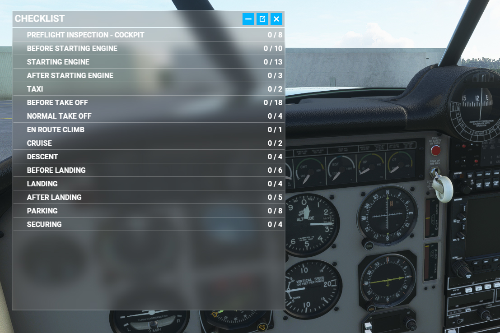
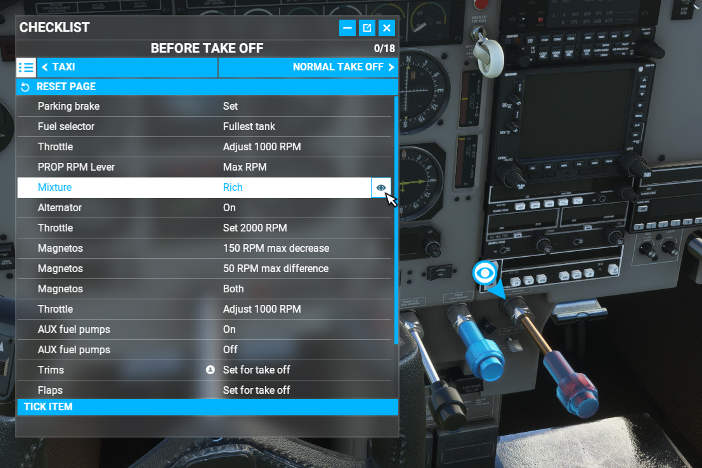

# In-Game Checklist for Carenado M20R Ovation

This program adds a very rudimentary checklist for the Carenado M20R. You must purchase this aircraft separately (through the in-game marketplace) for this to work. The checklist is currently very basic and attempts to mimic the PDF checklist provided by Carenado by just re-using steps from the framework created by Asobo for the stock aircraft. Camera hints are not yet implemented and it is unlikely to work with the AI co-pilot. 

